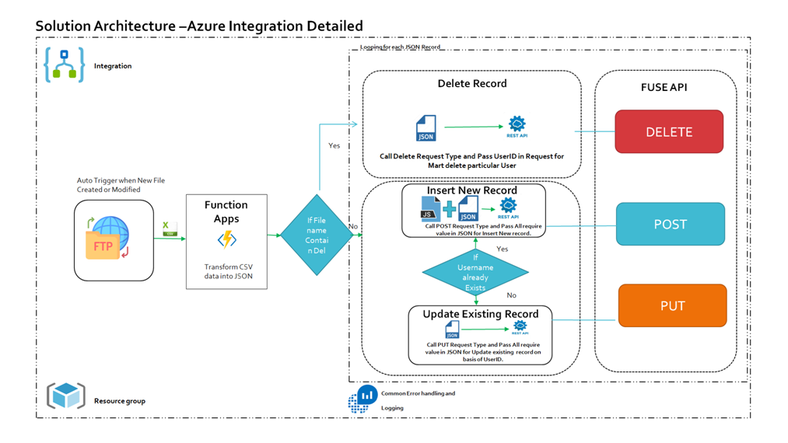
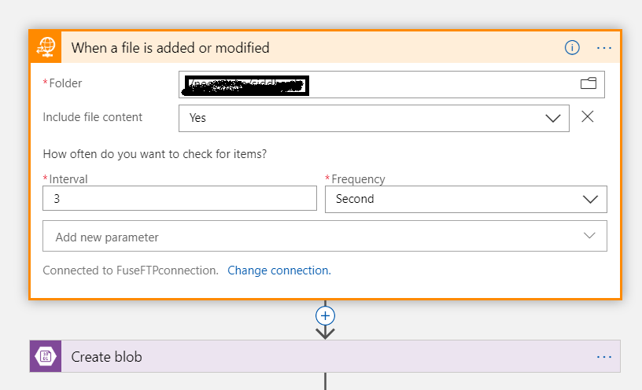
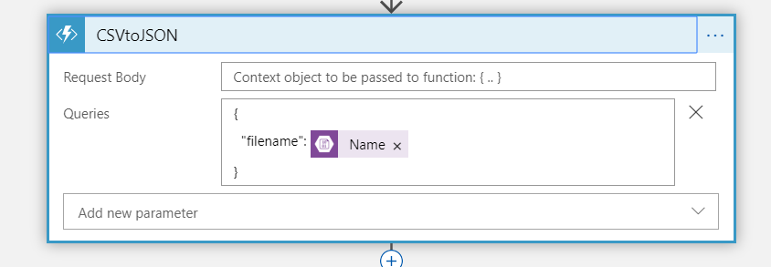
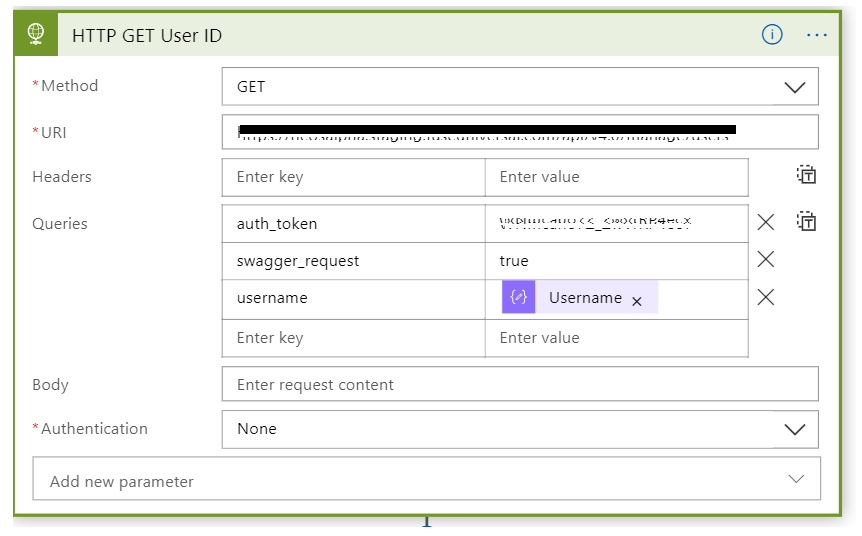

# Configure Auto Event when csv file is created or modified on FTP Server, Parse data into JSON using Function App and Configure with Rest API using Logic App.
**Produced by NeosAlpha Technologies**

# Introduction
In this demo we will logic App which automatically trigger when any CSV file create or modified on FTP server. Trasform file data into JSON format using Function App
and configure Rest API for all data.

# Soltion Architecture Design

# Set up

In the Azure portal, create a HTTP Trigger Function App auto configure with Azure Blob storage.File name of CSV file stored into blob storage read from Function App Url Query string or Header values.
Read data from CSV file and Transform data into JSON format.

In the Logic App interface, go to the Logic App designer and add a recurrence trigger.

Functionality we are including in this Process:

•	Auto event occur when new file is created or modified on FTP server.
•	Copy file from FTP server to Azure Blob Storage
•	Transform CSV file into JSON format using Azure Function App HTTP Trigger.
•	Initialize Parameter and set value of that parameter from response of Rest API.
•	Perform Various Http Request Type like PUT/POST/DELETE using Logic App and perform each activity.
•	Manage Proper Handling.
•	Configure Azure Log Analytics.

# Function App

Go to the Logic App designer and add a FTP Activity, It will auto trigger when new file added or modified on configured FTP Server.Use Create blob Activity for Create file into Blob storage container from FTP server.

We are configuring Function App for transform CSV data into JSON format. Here we are passing filename in dunction query input block.

We are using if condition in Logic App for define next step. If File name contain del its mean condition is True then Steps defile in True condition will execute other wise steps defined in false block will execute.

In Logic App we are using HTTP activity for configuring Third Party API. Here we are using Third Party API URL with Authorisation Key and Required inputs in Body in JSON Format.

      
        [FunctionName("CSVtoJSON")]
        public static IActionResult Run([HttpTrigger(AuthorizationLevel.Function, "get", "post", Route =null)] HttpRequest req
        , [Blob("hotfile/{query.filename}", FileAccess.Read, Connection = "AzureWebJobsStorage")]Stream myBlob, TraceWriter log)
        {
            log.Info("C# HTTP trigger function processed a request.");
            string name = req.Query["name"];
            var json = Convert(myBlob);
            return (ActionResult)new OkObjectResult(json);
           
        }
        public static string Convert(Stream blob)
        {
            // Properties per = new Properties();
            //List<Properties> records = new List<Properties>();
            var sReader = new StreamReader(blob);
            var csv = new CsvReader(sReader);

            csv.Read();
            csv.ReadHeader();

            //*** To add into list without customization ***//
            var csvRecords = csv.GetRecords<object>().ToList();

            return JsonConvert.SerializeObject(csvRecords);
        }

# Logic App
Go to the Logic App designer and add a FTP File trigger. Use Copy Activity for Move file into Blob Storage. After that configure Function App for Transform data into JSON format for further Process.

